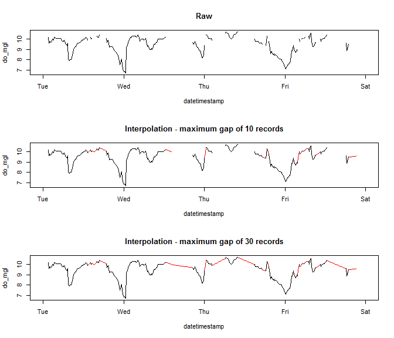
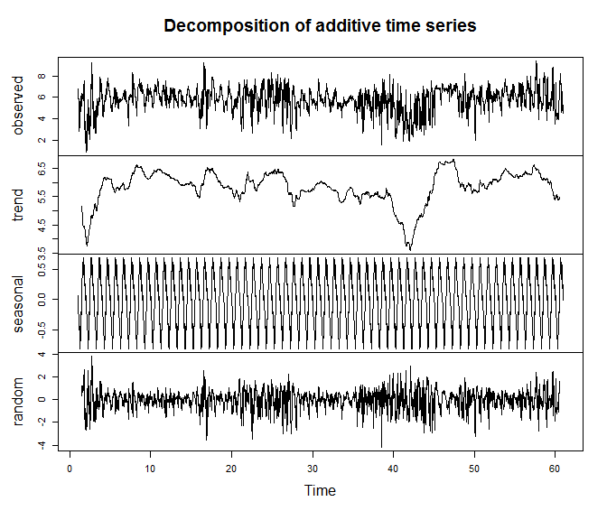
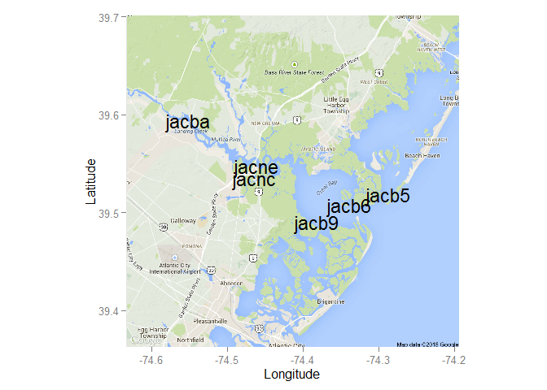
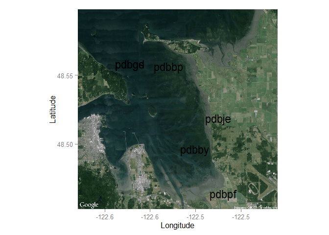
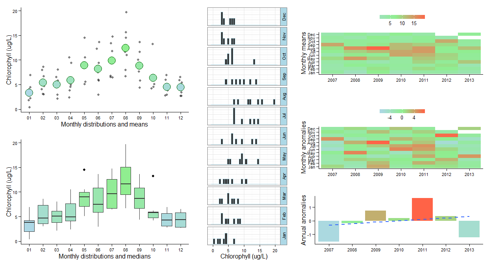
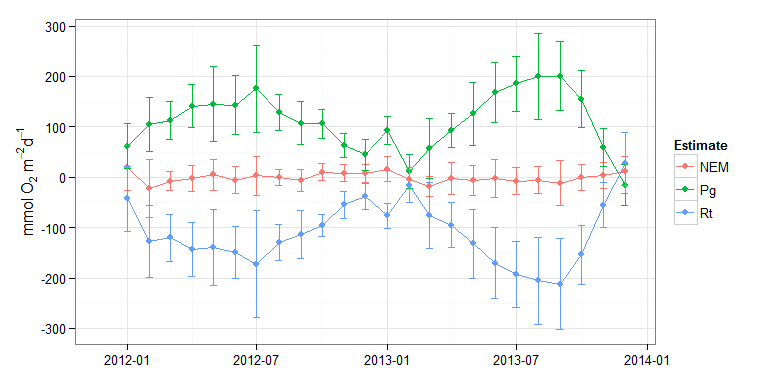

# SWMPr: An R package for the National Estuarine Research Reserve System
Marcus W. Beck, beck.marcus@epa.gov  

[](https://travis-ci.org/fawda123/SWMPr)

#Overview 

SWMPr is an R package that contains functions for retrieving, organizing, and analyzing estuary monitoring data from the System Wide Monitoring Program ([SWMP](http://nerrs.noaa.gov/RCDefault.aspx?ID=18)).  SWMP was implemented by the National Estuarine Research Reserve System ([NERRS](http://nerrs.noaa.gov/)) in 1995 to provide continuous monitoring data at over 300 stations in 28 estuaries across the United States.  SWMP data are maintained online by the Centralized Data Management Office (CDMO). This R package provides several functions to retrieve, organize, and analyze SWMP data from the CDMO.  Information on the CDMO web services are available [here](http://cdmo.baruch.sc.edu/webservices.cfm).  Data can be downloaded directly from the CDMO using functions in this package, although it is easier to first download data outside of R and then use the `import_local` function.  Your computer's IP address must be registered by CDMO staff for direct downloads in R.  Detailed methods for importing SWMP data in R are described below.  

All data obtained from the CDMO should be [cited](http://cdmo.baruch.sc.edu/data/citation.cfm) using the format:

*National Estuarine Research Reserve System (NERRS). 2012. System-wide Monitoring Program. Data accessed from the NOAA NERRS Centralized Data Management Office website: http://cdmo.baruch.sc.edu/; accessed 12 October 2012.*

To cite this package:

*Beck MW. 2015. SWMPr: An R package for the National Estuarine Research Reserve System.  Version 1.9.0. https://github.com/fawda123/SWMPr*

#Installing the package

This package is currently under development and has not been extensively tested.  The development version can be installed from Github:


```r
install.packages('devtools')
library(devtools)
install_github('fawda123/SWMPr')
library(SWMPr)
```


Note that the current version of devtools (v1.6.1) was built under R version 3.1.1.  The SWMPr package may not install correctly with older versions of R.

#Data retrieval

SWMP data can be used in R after they are obtained directly from the CDMO through an online query or by using the retrieval functions provided in this package.  In the latter case, the IP address for the computer making the request must be registered with CDMO.  This can be done by following instructions [here](http://cdmo.baruch.sc.edu/webservices.cfm).  The [metadata](http://cdmo.baruch.sc.edu/data/metadata.cfm) should also be consulted for available data, including the parameters and date ranges for each monitoring station.  Metadata are included as a .csv file with data requested from the CDMO and can also be obtained using the `site_codes` (all sites) or `site_codes_ind` (individual site) functions.  Again, these functions will only work if the computer's IP address is registered with CDMO. 


```r
# retrieve metadata for all sites
site_codes()

# retrieve metadata for a single site
site_codes_ind('apa')
```

Due to rate limitations on the server, the retrieval functions in this package return a limited number of records.  The functions are more useful for evaluating short time periods, although these functions could be used iteratively (i.e., with `for` or `while` loops) to obtain longer time series.  Data retrieval functions to access the CDMO include `all_params`, `all_params_dtrng`, and `single_param`.  These are functions that call the existing methods on the CDMO web services.  `all_params` returns the most recent 100 records of all parameters at a station, `all_params_dtrng` returns all records within a date range for all parameters or a single parameter, and `single_param` is identical to `all_params` except that a single parameter is requested.    


```r
# all parameters for a station, most recent
all_params('hudscwq')

# get all parameters within a date range
all_params_dtrng('hudscwq', c('09/10/2012', '02/8/2013'))

# get single parameter within a date range
all_params_dtrng('hudscwq', c('09/10/2012', '02/8/2013'), param = 'do_mgl')

# single parameter for a station, most recent
single_param('hudscwq', 'do_mgl')
```

SWMP data can also be imported from an independent server using the `import_remote` function.  Retrieval time is much faster because the files are in binary format for quick import. However, the data are only available up to December 2014 and may not be regularly updated. Always use the CDMO for current data. The data have also been pre-processed using the `qaqc` and `setstep` functions.  The files are available [here](https://s3.amazonaws.com/swmpalldata/). Files can be obtained using the function or by copying the URL to a web browser with the station name appended to the address, including the .RData file extension. For example, [https://s3.amazonaws.com/swmpalldata/acebbnut.RData](https://s3.amazonaws.com/swmpalldata/acebbnut.RData).  The following shows how to view the available files and use of the function to import a nutrient data file.


```r
## see the available files on the server
library(XML)
library(httr)
files_s3 <- GET('https://s3.amazonaws.com/swmpalldata/')$content
files_s3 <- rawToChar(files_s3)
files_s3 <- htmlTreeParse(files_s3, useInternalNodes = TRUE)
files_s3 <- xpathSApply(files_s3, '//contents//key', xmlValue)

## import a file
dat <- import_remote('acebbnut')

head(dat)

attributes(dat)
```

For larger custom requests, it's easier to obtain data outside of R using the CDMO query system and then importing within R using the `import_local` function.  Data can be retrieved from the CDMO several ways.  The `import_local` function is designed for data from the [zip downloads](http://cdmo.baruch.sc.edu/aqs/zips.cfm) feature in the advanced query section of the CDMO. The function may also work using data from the [data export system](http://cdmo.baruch.sc.edu/get/export.cfm), but this feature has not been extensively tested (expect bugs).  The [zip downloads](http://cdmo.baruch.sc.edu/aqs/zips.cfm) feature is an easy way to obtain data from multiple stations in one request.  The downloaded data will be in a compressed folder that includes multiple .csv files by year for a given data type (e.g., apacpwq2002.csv, apacpwq2003.csv, apacpnut2002.csv, etc.).  It is recommended that all stations at a site and the complete date ranges are requested to avoid repeated requests to CDMO.  The `import_local` function can be used after the folder is decompressed.

Occasionally, duplicate time stamps are present in the raw data.  The function handles duplicate entries differently depending on the data type (water quality,  weather, or nutrients).  For water quality and nutrient data, duplicate time stamps are simply removed.  Note that nutrient data often contain replicate samples with similar but not duplicated time stamps within a few minutes of each other.  Replicates with unique time stamps are not removed but can be further processed using `rem_reps`.  Weather data prior to 2007 may contain duplicate time stamps at frequencies for 60 (hourly) and 144 (daily) averages, in addition to 15 minute frequencies.  Duplicate values that correspond to the smallest value in the frequency column (15 minutes) are retained.  


```r
# import data for apaebmet that you downloaded

# this is an example path with the csv files, change as needed
path <- 'C:/my_path/'

# import, do not include file extension
import_local(path, 'apaebmet') 
```

Raw csv data have not been included in the package due to size limitations.  However, a sample dataset can be [downloaded](https://s3.amazonaws.com/swmpexdata/zip_ex.zip) for use with the examples below.  This dataset has an identical format as the data returned from the zip downloads feature of the CDMO.  However, import time of the raw data may slow down use of the examples below and I have included binary data files (.RData) that are processed versions of the raw data.    

#The swmpr object class

All data retrieval functions return a swmpr object that includes relevant data and several attributes describing the dataset.  The data include a datetimestamp column in the appropriate timezone for a station.  Note that the datetimestamp is standard time for each timezone and does not include daylight savings. Additional columns include parameters for a given data type (weather, nutrients, or water quality) and correspondingg QAQC columns if returned from the initial data request.  The attributes for a swmpr object include `names` of the dataset, `class` (swmpr) `station name` (7 or 8 characters), `qaqc_cols` (logical), `date_rng` (POSIX vector), `timezone` (text string in country/city format), `stamp_class` (class of datetimestamp vector, POSIX or Date), and `parameters` (character vector).  Attributes of a swmpr object can be viewed as follows:


```r
# import binary data
data(apadbwq)
dat <- apadbwq

# verify that dat is swmpr class
class(dat)
```

```
## [1] "swmpr"      "data.frame"
```

```r
# all attributes of dat
names(attributes(dat))
```

```
## [1] "names"       "row.names"   "class"       "station"     "parameters" 
## [6] "qaqc_cols"   "date_rng"    "timezone"    "stamp_class"
```

```r
# a single attribute of dat
attr(dat, 'station')
```

```
## [1] "apadbwq"
```

The swmpr object class was created for use with specific methods and it is suggested that these methods be used for data organization and analysis.  A swmpr object also secondarily inherits methods from the data.frame class, such that common data.frame methods also apply to swmpr objects.  Available methods for the swmpr class are described below and can also be viewed:


```r
# available methods for swmpr class
methods(class = 'swmpr')
```

```
##  [1] aggregate.swmpr       aggregate_metab.swmpr comb.swmpr           
##  [4] decomp.swmpr          decomp_cj.swmpr       ecometab.swmpr       
##  [7] hist.swmpr            lines.swmpr           na.approx.swmpr      
## [10] plot.swmpr            plot_metab.swmpr      plot_summary.swmpr   
## [13] qaqc.swmpr            qaqcchk.swmpr         rem_reps.swmpr       
## [16] setstep.swmpr         smoother.swmpr        subset.swmpr
```

#An overview of methods for swmpr objects

Three categories of functions are available: retrieve, organize, and analyze.  The retrieval functions import the data into R as a swmpr object for use with the organize and analyze functions.  Methods defined for swmpr objects can be applied with the organize and analyze functions.  These methods are available for generic functions specific to this package, in addition to methods for existing generic functions available from other packages.  S3 methods are implemented in all cases.  

The organize functions are used to clean or prepare the data for analysis, including removal of QAQC flags, subsetting, creating a standardized time series vector, and combining data of different types.  The `qaqc` function is a simple screen to retain values from the data with specified QAQC flags, described [here](http://cdmo.baruch.sc.edu/data/qaqc.cfm).  Each parameter in the swmpr data typically has a corresponding QAQC column of the same name with the added prefix 'f_'.  Values in the QAQC column specify a flag from -5 to 5.  Generally, only data with the '0' QAQC flag should be used, which is the default option for the `qaqc` function.  Data that do not satisfy QAQC criteria are converted to NA values.   Additionally, simple filters are used to remove obviously bad values, e.g., wind speed values less than zero or pH values greater than 12. Erroneous data entered as -99 are also removed. Processed data will have QAQC columns removed, in addition to removal of values in the actual parameter columns that do not meet the criteria. 


```r
# qaqc screen for a swmpr object, retain only '0'
qaqc(dat)

# retain all data regardless of flag
qaqc(dat, qaqc_keep = NULL)

# retain only '0' and '-1' flags
qaqc(dat, qaqc_keep = c(0, -1))
```

Viewing the number of observations for each parameter that are assigned to a QAQC flag may be useful for deciding how to process the data with `qaqc`.  The `qaqcchk` function can be used to view this information.  Consult the [online documentation](http://cdmo.baruch.sc.edu/data/qaqc.cfm) for a description of each QAQC flag. 


```r
# view the number observations in each QAQC flag
qaqcchk(dat)
```

Raw nutrient data obtained from the CDMO will usually include replicate samples that were taken within a few minutes of each other.  The `rem_reps.swmpr` function combines nutrient data that occur on the same day to preserve an approximate monthly time step.  The datetimestamp column will always be averaged for replicates, but the actual observations will be combined based on the user-supplied function which defauls to the mean.  Other suggested functions include the `median`, `min`, or `max`.  The entire function call including treatment of NA values should be passed to the `FUN` argument (see the examples).  The function is meant to be used after `qaqc` processing, although it works with a warning if QAQC columns are present.


```r
# get nutrient data
data(apacpnut)
swmp1 <- apacpnut
swmp1 <- qaqc(swmp1)

# remove replicate nutrient data
rem_reps(swmp1)

# use different function to aggregate replicates
func <- function(x) max(x, na.rm = T)
rem_reps(swmp1, FUN = func)
```

A subset method added to the existing `subset` function is available for swmpr objects.  This function is used to subset the data by date and/or a selected parameter.  The date can be a single value or as two dates to select records within the range. The former case requires a binary operator input as a character string passed to the argument, such as `>` or `<`.  The subset argument for the date(s) must also be a character string of the format YYYY-mm-dd HH:MM for each element (i.e., %Y-%m%-%d %H:%M in POSIX standards).  Be aware that an error may be returned using this function if the subset argument is in the correct format but the calendar date does not exist, e.g. `2012-11-31 12:00`.  Finally, the function can be used to remove rows and columns that do not contain data. 


```r
# select two parameters from dat
subset(dat, select = c('rh', 'bp'))

# subset records greater than or equal to a date
subset(dat, subset = '2013-01-01 0:00', operator = '>=')

# subset records within a date range
subset(dat, subset = c('2012-07-01 6:00', '2012-08-01 18:15'))

# subset records within a date range, select two parameters
subset(dat, subset = c('2012-07-01 6:00', '2012-08-01 18:15'),
  select = c('atemp', 'totsorad'))

# remove rows/columns that do not contain data
subset(dat, rem_rows = T, rem_cols = T)
```

The `setstep` function formats a swmpr object to a continuous time series at a given time step.  This function is not necessary for most stations but can be useful for combining data or converting an existing time series to a set interval.  The first argument of the function, `timestep`, specifies the desired time step in minutes starting from the nearest hour of the first observation.  The second argument, `differ`, specifies the allowable tolerance in minutes for matching existing observations to user-defined time steps in cases where the two are dissimilar.  Values for `differ` that are greater than one half the value of `timestep` are not allowed to prevent duplication of existing data.  Likewise, the default value for `differ` is one half the time step.  Rows that do not match any existing data within the limits of the `differ` argument are not discarded.  Output from the `setstep` function can be used with `subset` and to create a time series at a set interval with empty data removed.


```r
# convert time series to two hour invervals
# tolerance of +/- 30 minutes for matching existing data
setstep(dat, timestep = 120, differ = 30)

# convert a nutrient time series to a continuous time series
# then remove empty rows and columns
data(apacpnut)
dat_nut <- apacpnut
dat_nut <- setstep(dat_nut, timestep = 60)
subset(dat_nut, rem_rows = T, rem_cols = T)
```

The `comb` function is used to combine multiple swmpr objects into a single object with a continuous time series at a given step.  The `timestep` function is used internally such that `timestep` and `differ` are accepted arguments for `comb`.  The function requires one or more swmpr objects as input as separate, undefined arguments.  The remaining arguments must be called explicitly since an arbitrary number of objects can be used as input.  In general, the function combines data by creating a master time series that is used to iteratively merge all swmpr objects.  The time series for merging depends on the value passed to the `method` argument.  Passing `union` to `method` will create a time series that is continuous starting from the earliest date and the latest date for all input objects.  Passing `intersect` to `method` will create a time series that is continuous from the set of dates that are shared between all input objects.  Finally, a seven or eight character station name passed to `method` will merge all input objects based on a continuous time series for the given station.  The specified station must be present in the input data.  Currently, combining data types from different stations is not possible, excluding weather data which are typically at a single, dedicated station.  


```r
# get nuts, wq, and met data as separate objects for the same station
# note that most sites usually have one weather station
data(apacpnut)
data(apacpwq)
data(apaebmet)
swmp1 <- apacpnut
swmp2 <- apacpwq
swmp3 <- apaebmet

# combine nuts and wq data by union
comb(swmp1, swmp2, method = 'union')

# combine nuts and wq data by intersect
comb(swmp1, swmp3, method = 'intersect')

# combine nuts, wq, and met data by nuts time series, two hour time step
comb(swmp1, swmp2, swmp3, timestep = 120, method = 'apacpnut')
```

The analysis functions range from general purpose tools for time series analysis to more specific functions for working with continuous monitoring data in estuaries.  The latter category includes a limited number of functions that were developed by myself or others.  The general purpose tools are swmpr methods that were developed for existing generic functions in the R base installation or relevant packages.  These functions include swmpr methods for `aggregate`, `filter`, and `approx` to deal with missing or noisy data and more general functions for exploratory data analaysis, such as `plot`, `summary`, and `hist` methods.  Decomposition functions (`decomp` and `decomp_cj`) are provided as relatively simple approaches for decomposing time series into additive or multiplicative components. The analysis functions may or may not return a swmpr object depending on whether further processing with swmpr methods is possible from the output.    

The `aggregate` function aggregates parameter data for a swmpr object by set periods of observation.  This function is most useful for aggregating noisy data to evaluate trends on longer time scales, or to simply reduce the size of a dataset.  Data can be aggregated by years, quarters, months, weeks, days, or hours for a user-defined function, which defaults to the mean.  A swmpr object is returned for the aggregated data, although the datetimestamp vector will be converted to a date object if the aggregation period is a day or longer.  Days are assigned to the date vector if the aggregation period is a week or longer based on the `round` method for IDate objects ([data.table](http://cran.r-project.org/web/packages/data.table/index.html) package).  This approach was used to facilitate plotting using predefined methods for Date and POSIX objects.  Additionally, the method of treating NA values for the aggregation function should be noted since this may greatly affect the quantity of data that are returned (see the example below).  Finally, the default argument for `na.action` is set to `na.pass` for swmpr objects to preserve the time series of the input data.


```r
# combine, qaqc, remove empty columns
dat <- comb(swmp1, swmp2, method = 'union')
dat <- qaqc(dat)
swmpr_in <- subset(dat, rem_cols = T)

# get mean DO by quarters
aggregate(swmpr_in, 'quarters', params = c('do_mgl'))

# get mean DO by quarters, remove NA when calculating means
fun_in <- function(x) mean(x, na.rm = T)
aggregate(swmpr_in, FUN = fun_in, 'quarters', params = c('do_mgl'))
```

Time series can be smoothed to better characterize a signal independent of noise.  Although there are many approaches to smoothing, a moving window average is intuitive and commonly used.  The `smoother` function can be used to smooth parameters in a swmpr object using a specified window size.  This method is a simple wrapper to `filter`.  The `window` argument specifies the number of observations included in the moving average.  The `sides` argument specifies how the average is calculated for each observation (see the documentation for `filter`).  A value of 1 will filter observations within the window that are previous to the current observation, whereas a value of 2 will filter all observations within the window centered at zero lag from the current observation. As before, the `params` argument specifies which parameters to smooth.


```r
# import data
data(apadbwq)
swmp1 <- apadbwq

# qaqc and subset imported data
dat <- qaqc(swmp1)
dat <- subset(dat, subset = c('2012-07-09 00:00', '2012-07-24 00:00'))

# filter
test <- smoother(dat, window = 50, params = 'do_mgl')

# plot to see the difference
plot(do_mgl ~ datetimestamp, data = dat, type = 'l')
lines(test, select = 'do_mgl', col = 'red', lwd = 2)
```

 

A common issue with any statistical analysis is the treatment of missing values.  Missing data can be excluded from the analysis, included but treated as true zeroes, or interpolated based on similar values.  In either case, an analyst should have a strong rationale for the chosen method.  A common approach used to handle missing data in time series analysis is linear interpolation.  A simple curve fitting method is used to create a continuous set of records between observations separated by missing data.  A challenge with linear interpolation is an appropriate gap size for fitting missing observations.  The ability of the interpolated data to approximate actual trends is a function of the gap size.  Interpolation between larger gaps are less likely to resemble patterns of an actual parameter, whereas interpolation between smaller gaps are more likely to resemble actual patterns.  An appropriate gap size limit depends on the unique characteristics of specific datasets or parameters.  The `na.approx` function can be used to interpolate gaps in a swmpr object.  A required argument for the function is `maxgap` which defines the maximum gap size  for interpolation.


```r
# get data
data(apadbwq)
swmp1 <- apadbwq

# qaqc and subset imported data
dat <- qaqc(swmp1)
dat <- subset(dat, subset = c('2013-01-22 00:00', '2013-01-26 00:00'))

# interpolate, maxgap of 10 records
test <- na.approx(dat, params = 'do_mgl', maxgap = 10)

# interpolate maxgap of 30 records
test2 <- na.approx(dat, params = 'do_mgl', maxgap = 30)

# plot for comparison
par(mfrow = c(3, 1))
plot(do_mgl ~ datetimestamp, dat, main = 'Raw', type = 'l')
plot(do_mgl ~ datetimestamp, test, col = 'red', 
  main = 'Interpolation - maximum gap of 10 records', type = 'l')
lines(dat, select = 'do_mgl')
plot(do_mgl ~ datetimestamp, test2, col = 'red', 
  main = 'Interpolation - maximum gap of 30 records', type = 'l')
lines(dat, select = 'do_mgl')
```

 

The `decomp` function is a simple wrapper to `decompose` that separates a time series into additive or multiplicative components describing a trend, cyclical variation (e.g., daily or seasonal), and the remainder.  The additive decomposition assumes that the cyclical component of the time series is stationary (i.e., the variance is constant), whereas a multiplicative decomposition accounts for non-stationarity.  By default, a moving average with a symmetric window is used to filter the seasonal component.  Alternatively, a vector of filter coefficients in reverse time order can be supplied (see the help documentation for `decompose`).  

The `decompose` function requires a ts object with a specified frequency as input.  The `decomp` function converts the input swmpr vector to a ts object prior to `decompose`.  This requires an explicit input defining the frequency of the parameter in the time series.  For example, the frequency of a parameter with diurnal periodicity would be 96 if the time step is 15 minutes (4 * 24).  The frequency of a parameter with seasonal periodicity would be 35040 (4 * 24 * 365).  For simplicity, character strings of `'daily'` or `'seasonal'` can be supplied in place of numeric values.  A starting value of the time series must be supplied in the latter case.  Use of the `setstep` function is also required to standardize the time step prior to decomposition.  

Note that the `decompose` function is a relatively simple approach and alternative methods should be investigated if a more sophisticated decomposition is desired.


```r
# get data
data(apadbwq)
swmp1 <- apadbwq

# subset for daily decomposition
dat <- subset(swmp1, subset = c('2013-07-01 00:00', '2013-07-31 00:00'))

# decomposition and plot
test <- decomp(dat, param = 'do_mgl', frequency = 'daily')
plot(test)
```

 

The next example illustrates how to handle missing values using the `decomp` function. The `decompose` function used internally within `decomp` currently cannot process time series with missing values.  A recommended approach is to use `na.approx` to interpolate the missing values prior to `decompose`.


```r
# get data
dat <- subset(swmp1, subset = c('2013-06-01 00:00', '2013-07-31 00:00'))

# this returns an error
# test <- decomp(dat, param = 'do_mgl', frequency = 'daily')

# how many missing values?
sum(is.na(dat$do_mgl))
```

```
## [1] 3
```

```r
# use na.approx to interpolate missing data
dat <- na.approx(dat, params = 'do_mgl', maxgap = 10)

# decomposition and plot
test <- decomp(dat, param = 'do_mgl', frequency = 'daily')
plot(test)
```

 

An alternative approach to time series decomposition is provided by the `decomp_cj` function, which is a simple wrapper to the `decompTs` function in the wq package.  Theory describing this method is described in Cloern and Jassby (2010).  The function is similar to `decomp.swmpr` with a few key differences.  The `decomp.swmpr` function decomposes the time series into a trend, seasonal, and random component, whereas the current function decomposes into the grandmean, annual, seasonal, and events components.  For both functions, the random or events components, respectively, can be considered anomalies that don't follow the trends in the remaining categories.  The `decomp_cj` function provides only a monthly decomposition, which is appropriate for characterizing relatively long-term trends.  This approach is meant for nutrient data that are obtained on a monthly cycle.  The function will also work with continuous water quality or weather data but note that the data are first aggregated on the monthly scale before decomposition.  Accordingly, short-term variation less than one-month will be removed. Additional arguments passed to `decompTs` can be used with `decomp_cj`, such as `startyr`, `endyr`, and `type`.  Values passed to `type` are `mult` (default) or `add`, referring to multiplicative or additive decomposition.  See the documentation for `decompTs` for additional explanation and examples.   


```r
# get data
data(apacpnut)
dat <- apacpnut
dat <- qaqc(dat, qaqc_keep = NULL)

# decomposition of chl, ggplot
decomp_cj(dat, param = 'chla_n')
```

 

A reserve map with all stations can be obtained using the `map_reserve` function.  This function is a simple wrapper to functions in the ggmap package. The current function is limited to Google maps, which allows four map types that can be set with the `map_type` argument: terrain (default), satellite, roadmap, or hybrid.  The `zoom` argument may have to be chosen through trial and error depending on the spatial extent of the reserve.  See the help documentation for ggmap for more info on zoom.  Additionally, station locations are returned using the `site_codes_ind` function if the computer making the request has the IP address registered with CDMO. Otherwise, a local and possibly outdated file is used.  Use the contact at the CDMO [web services](http://cdmo.baruch.sc.edu/webservices.cfm) to register your IP.


```r
# plot the stations at Jacques Cousteau reserve
map_reserve('jac')
```

 

```r
# plot the stations at Padilla Bay reserve, satellite
map_reserve('pdb', map_type = 'satellite', zoom = 12)
```

 

Several graphics showing seasonal and annual trends for a given SWMP parameter can be obtained using the `plot_summary` function.  The plots include monthly distributions, monthly anomalies, and annual anomalies in multiple formats.  Anomalies are defined as the difference between the monthly or annual average from the grand mean for the parameter.  Monthly anomalies are in relation to the grand mean for the same month across all years.  All data are aggregated for quicker plotting.  Nutrient data are based on monthly averages, whereas weather and water quality data are based on daily averages.  Cumulative precipitation data are based on the daily maximum. The function returns a graphics object (Grob) of multiple ggplot objects.  An interactive Shiny widget that uses this function is available: [https://beckmw.shinyapps.io/swmp_summary/](https://beckmw.shinyapps.io/swmp_summary/).


```r
## import data
data(apacpnut)
dat <- qaqc(apacpnut)

## plot
plot_summary(dat, param = 'chla_n', years = c(2007, 2013))
```

 

Estimates of ecosystem metabolism provide a useful measure of overall system productivity.  These estimates are commonly used to evaluate whether an ecosystem is a net source or sink of organic material.  The open-water method is a common approach to quantify net ecosystem metabolism using a mass balance equation that describes the change in dissolved oxygen over time from the balance between photosynthetic and respiration rates, corrected for air-sea gas diffusion at the surface.  The diffusion-corrected DO flux estimates are averaged during day and night for each 24 hour period in the time series, where flux is an hourly rate of DO change. DO flux is averaged during night hours for respiration and averaged during day hours for net production. Respiration rates are assumed constant during day and night such that total daily rates are calculated as hourly respiration multiplied by 24. The metabolic day is considered the 24 hour period between sunsets on two adjacent calendar days.  Respiration is subtracted from daily net production estimates to yield gross production.  

The `ecometab` function is used to implement an adaptation of the open-water method.  Several assumptions must be met for a valid interpretation of the results.  In general, the dissolved oxygen time series is assumed to represent the same water mass over time.  Tidal advection may have a significant influence on the time series, which can contribute to a significant amount of noise in metabolic estimates.  The extent to which tidal advection influences the dissolved oxygen signal depends on various site-level characteristics and an intimate knowledge of the site may be required.  Volumetric rates for gross production and total respiration are also based on total depth of the water column, which is assumed to be mixed.  Water column depth is based on mean value for the depth variable across the time series and is floored at 1 meter for very shallow stations.  Additionally, the volumetric reaeration coefficient requires an estimate of the anemometer height of the weather station, which is set as 10 meters by default.  The metadata should be consulted for exact height. Other assumptions may apply and the user should consult the relevant literature (see the references in the help file).  All estimates are in mmol of oxygen but can be converted  to grams by changing the default arguments (i.e., 1mmol O2 = 32 mg O2, 1000 mg = 1g, multiply all estimates by 32/1000). 

The following is an example that shows how to use the function from a combined water quality and weather data set.  The results can be plotted using `plot_metab`.


```r
## import water quality and weather data
data(apadbwq)
data(apaebmet)

## qaqc, combine
wq <- qaqc(apadbwq)
met <- qaqc(apaebmet)
dat <- comb(wq, met)

## estimate metabolism
res <- ecometab(dat, trace = FALSE)
plot_metab(res)
```

 

#Function list

See help documentation for more details on each function (e.g., `?all_params`).

##Retrieve

`all_params` Retrieve up to 100 records starting with the most recent at a given station, all parameters.  Wrapper to `exportAllParamsXMLNew` function on web services. 

`all_params_dtrng` Retrieve records of all parameters within a given date range for a station.  Optional argument for a single parameter.  Maximum of 1000 records. Wrapper to `exportAllParamsDateRangeXMLNew`.

`import_local` Import files from a local path.  The files must be in a specific format, specifically those returned from the CDMO using the [zip downloads](http://cdmo.baruch.sc.edu/aqs/zips.cfm) option for a reserve.

`import_remote` Import SWMP site data from a remote independent server.  These files have been downloaded from CDMO, processed using functions in this package, and uploaded to an Amazon server for quicker import into R.  

`single_param` Retrieve up to 100 records for a single parameter starting with the most recent at a given station.  Wrapper to `exportSingleParamXMLNew` function on web services. 

##Organize

`comb.swmpr` Combines swmpr objects to a common time series using setstep, such as combining the weather, nutrients, and water quality data for a single station. Only different data types can be combined.

`qaqc.swmpr` Remove QAQC columns and remove data based on QAQC flag values for a swmpr object.  Only applies if QAQC columns are present.  

`qaqcchk.swmpr` View a summary of the number of observations in a swmpr object that are assigned to different QAQC flags used by CDMO.  The output is used to inform further processing but is not used explicitly. 

`rem_reps.swmpr` Remove replicate nutrient data that occur on the same day.  The default is to average replicates.

`setstep.swmpr` Format data from a swmpr object to a continuous time series at a given timestep.  The function is used in `comb.swmpr` and can also be used with individual stations.

`subset.swmpr` Subset by dates and/or columns for a swmpr object.  This is a method passed to the generic `subset' function provided in the base package.

##Analyze

`aggregate.swmpr` Aggregate swmpr objects for different time periods - years, quarters, months,  weeks, days, or hours.  Aggregation function is user-supplied but defaults to mean. 

`aggregate_metab` Aggregate metabolism data from a swmpr object.  This is primarly used within `plot_metab` but may be useful for simple summaries of raw daily data.

`ecometab.swmpr` Estimate ecosystem metabolism for a combined water quality and weatehr dataset using the open-water method.

`decomp.swmpr` Decompose a swmpr time series into trend, seasonal, and residual components.  This is a simple wrapper to `decompose`.  Decomposition of monthly or daily trends is possible.

`decomp_cj.swmpr` Decompose a swmpr time series into grandmean, annual, seasonal, and events components.  This is a simple wrapper to `decompTs` in the wq package.  Only monthly decomposition is possible.

`hist.swmpr` Plot a histogram for a swmpr object.

`lines.swmpr` Add lines to an existing swmpr plot.

`na.approx.swmpr` Linearly interpolate missing data (`NA` values) in a swmpr object. The maximum gap size that is interpolated is defined as a maximum number of records with missing data. 

`plot.swmpr` Plot a univariate  time series for a swmpr object.  The parameter name must be specified.

`plot_metab` Plot ecosystem metabolism estimates after running `ecometab` on a swmpr object.  

`plot_summary` Create summary plots of seasonal/annual trends and anomalies for a water quality or weather parameter.

`smoother.swmpr` Smooth swmpr objects with a moving window average.  Window size and sides can be specified, passed to `filter`.

##Miscellaneous

`calcKL` Estimate the reaeration coefficient for air-sea gas exchange.  This is only used within the `ecometab` function.

`map_reserve` Create a map of all stations in a reserve using the ggmap package.

`metab_day` Identify the metabolic day for each approximate 24 period in an hourly time series.  This is only used within the `ecometab` function.

`param_names` Returns column names as a list for the parameter type(s) (nutrients, weather, or water quality).  Includes QAQC columns with 'f_' prefix. Used internally in other functions.

`parser` Parses html returned from CDMO web services, used internally in retrieval functions.

`site_codes` Metadata for all stations, wrapper to `exportStationCodesXMLNew` function on web services.

`site_codes_ind` Metadata for all stations at a single site, wrapper  to `NERRFilterStationCodesXMLNew` function on web services.

`swmpr` Creates object of swmpr class, used internally in retrieval functions.

`time_vec` Converts time vectors to POSIX objects with correct time zone for a site/station, used internally in retrieval functions.
